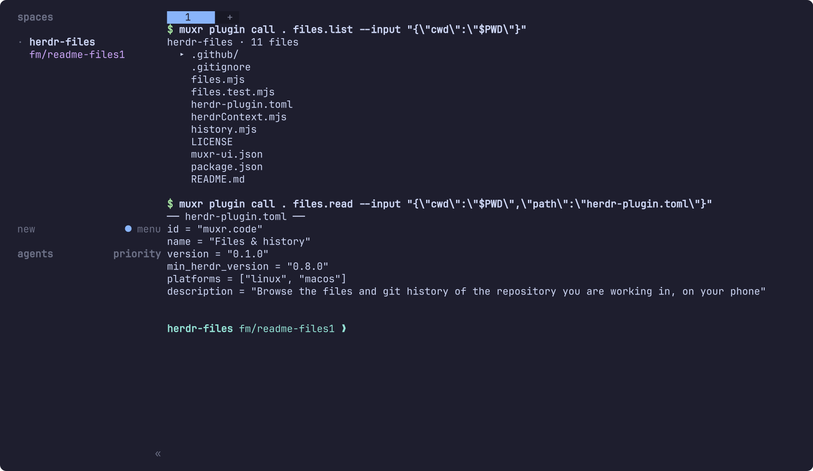
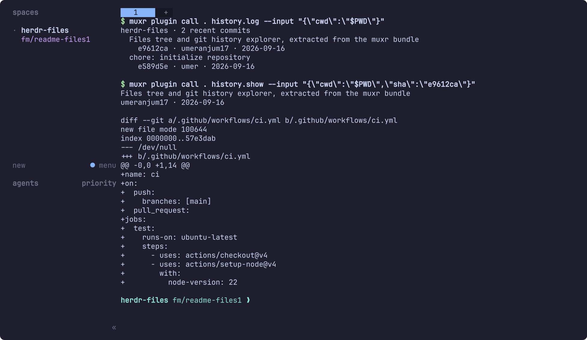
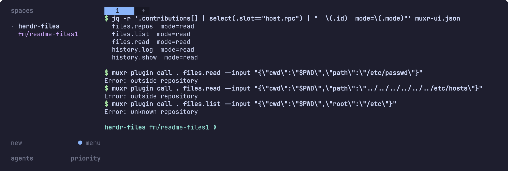

<h1 align="center">herdr-files</h1>

<p align="center">
  <a href="https://github.com/umeranjum17/herdr-files/actions/workflows/ci.yml"></a>
  <a href="LICENSE"></a>
  
  
</p>

<p align="center">
  <strong>The repository you are working in, on your phone.</strong><br/>
  herdr-files is a <a href="https://herdr.dev">Herdr</a> plugin for <a href="https://github.com/umeranjum17/muxr">muxr</a>. It adds a Files tab with a file tree for every git repository open in your session, bounded source previews, and the git history of the repository your agent is working in, including any commit's diff. It only reads, it has no dependencies, and it stays inside the repositories your session already opened.
</p>

<h3 align="center"><a href="#install"><ins>Install herdr-files</ins></a></h3>

<p align="center">
  
</p>

## Why herdr-files exists

An agent tells you it changed `cart.js`. On your phone you then want to know where that file sits, what is around it, and what the last few commits did. A live terminal is the wrong tool for that: you would have to type `ls`, `cat` and `git log` into the agent's own session.

herdr-files gives muxr native screens for those reads. muxr draws the tree, the source view and the diff. The plugin supplies bounded JSON through five read-only calls. It shows only repositories your session already has open.

## See it in action

The captures on this page are real output from this plugin, taken in an isolated Herdr session. Each one runs the plugin's own calls through `muxr plugin call`, the same author contract the muxr host uses. `cwd` is the value the host fills in from the session, so a caller can't choose it. On the phone, muxr renders the same data as a native tree, source view and diff.

### Browse the repository

The **Files** tab in muxr's side navigation lists every git repository open in your session. The **Files** button in a session's header opens the repository that session is in. Folders come first, and each folder loads its children only when you open it. Tap a file for a syntax-highlighted preview capped at 240 lines / 24 KiB, so a large file can't flood your phone. A binary file shows *Binary file — preview unavailable.* The capture at the top of this page is this screen's data.

### Read the history

**Git history** in a session's header lists the 25 most recent commits of the session's repository, with short hash, author and date. Tap a commit to open its unified diff.

<p align="center">
  
</p>

### Reads only, and only inside the session

Every RPC in the manifest is declared `mode: "read"`. Paths are resolved to their real location first, so a preview that points outside the repository is refused, whether it is an absolute path, a `..` climb or a symlink escape. A repository the session did not open is unknown.

<p align="center">
  
</p>

**Also:**

- **Bounded everywhere.** A folder shows its first 256 entries and says how many it held. A diff is cut at 60,000 characters, and the Files tab lists at most 32 repositories.
- **No working directory yet?** A session without one gets an empty history screen, not an error.
- **Offline.** muxr labels cached screens as stale and disables host actions until the host reconnects.

## What it will not do

- **Never writes.** It runs no git command that changes anything, edits no files and sends nothing to your terminal. Every RPC is declared `mode: "read"`, and a test in this repo fails if that ever changes.
- **Never opens what the session did not open.** A repository must come from the host's session context, and a preview must resolve inside that repository. Paths outside it are refused, including `..` traversal and symlink escapes.
- **No review of working-tree changes.** Seeing what your agent changed is part of muxr itself, on the session's Changes screen. This plugin only browses the tree and the history.
- **No file bytes leave your machine.** Previews are pulled to your phone when you open them, and nothing is uploaded anywhere else.

## Install

> **Download:** herdr-files ships as source only — there are no release artifacts yet. Install with the command below; future packaged versions, if any, will appear under [releases](https://github.com/umeranjum17/herdr-files/releases).

You need [Herdr](https://herdr.dev) 0.8.0 or newer, `node` 20 or newer on `PATH`, and `git` on `PATH`, on Linux or macOS. You also need a muxr app with declarative UI version 11 or newer. Any current self-host build qualifies; an older app lists the plugin as unavailable instead of showing part of it.

```sh
muxr plugin install umeranjum17/herdr-files
muxr plugin list        # muxr.code should appear, enabled
```

Herdr shows the plugin's source and asks you to confirm before enabling it.

Then, on your phone:

1. Open **Files** in muxr's side navigation and tap a repository.
2. Tap a folder to expand it, then tap a file for its preview.
3. In any session with a working directory, tap **Git history** in the session header, then tap a commit for its diff.

Turn it off without uninstalling:

```sh
herdr plugin disable muxr.code
herdr plugin enable muxr.code
```

### What it asks for

| | |
|---|---|
| **On your phone** | A **Files** tab, a **Files** button and a **Git history** button in the session header, and the screens they open. |
| **On the host** | `files.mjs` and `history.mjs`, run by `node` for each call. They run `git ls-files`, `git log`, `git show` and `git rev-parse`, and read one file for a preview. |
| **Data** | The `sessions` context, which is the host's sanitized session snapshot. The plugin uses only each session's working directory from it. The history calls get no session context, only the session's `cwd`, which the host fills in. |
| **Storage and secrets** | None. It keeps no state, writes no config, and asks for no secrets. |

## Uninstall

```sh
muxr plugin remove muxr.code    # or: herdr plugin uninstall muxr.code
```

It leaves nothing behind. The plugin keeps no state, writes no config and holds no secrets, and everything it shows was already on the machine.

## Development

```sh
git clone https://github.com/umeranjum17/herdr-files
cd herdr-files
npm test                  # node's built-in runner, zero dependencies; CI runs it on every PR
muxr plugin check .       # validates the manifest against muxr's plugin contract
muxr plugin call . history.log --input "{\"cwd\":\"$PWD\"}"   # run one RPC as the host would
```

The tests drive the real scripts the way the host does, with a fixture repository, real `git` and real process spawns. They don't mock the plugin's own output.

## License

MIT — see [LICENSE](LICENSE).
